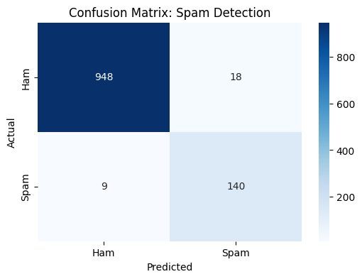

# Spam Detector Naive Bayes

A Multinomial Naive Bayes classifier implemented from scratch in Python to identify spam messages. This project focuses on the application of probabilistic modeling and Natural Language Processing (NLP) techniques to binary classification tasks.

## Project Overview
The detector processes raw text data through a custom pipeline, calculates word frequencies, and utilizes Laplace Smoothing to predict the probability of a message being "Ham" (legitimate) or "Spam." The implementation avoids high-level library abstractions for the core algorithm to demonstrate the underlying mathematical principles.

### Technical Features
* **Preprocessing**: Custom tokenization and cleaning using regular expressions.
* **Numerical Stability**: Implementation of log-likelihood summation to prevent floating-point underflow.
* **Laplace Smoothing**: Add-one smoothing to handle the zero-frequency problem for out-of-vocabulary words.
* **Stratified Splitting**: Ensures class distribution is maintained across training and testing sets.

## Performance Analysis

The model was evaluated on a test set comprising 20% of the total data. It achieved an overall accuracy of **98%**.

### Classification Report
| Class | Precision | Recall | F1-Score | Support |
| :--- | :--- | :--- | :--- | :--- |
| **Ham** | 0.99 | 0.98 | 0.99 | 966 |
| **Spam** | 0.89 | 0.94 | 0.91 | 149 |
| **Accuracy** | | | **0.98** | 1115 |

### Visualizations

#### Confusion Matrix
The confusion matrix highlights the model's precision, specifically its ability to minimize False Positives (legitimate emails incorrectly flagged as spam).



#### Word Frequency Distribution
These charts display the most frequent words found in each category after cleaning. Words such as "free" and "claim" serve as strong indicators for the spam class.


## Mathematical Foundation
The classifier is based on Bayes' Theorem, calculating the posterior probability of a class given a set of observed words:

$$P(Spam|Word) = \frac{P(Word|Spam) \cdot P(Spam)}{P(Word)}$$

To handle multiple words and ensure numerical stability, the model computes the sum of the logs of the probabilities:

$$\log(P(Spam)) + \sum_{i=1}^{n} \log(P(w_i | Spam))$$

## Installation and Setup
1.  **Clone the repository**:
    ```bash
    git clone [https://github.com/priyanshu-p-dey/spam-mail-detection-ai.git](https://github.com/priyanshu-p-dey/spam-mail-detection-ai.git)
    ```
2.  **Dataset**: Ensure `spam.csv` is located in the root directory.
3.  **Execute the script**:
    ```bash
    python spam_detector.py
    ```

## Requirements
* Python 3.x
* NumPy
* Pandas
* Matplotlib
* Seaborn
